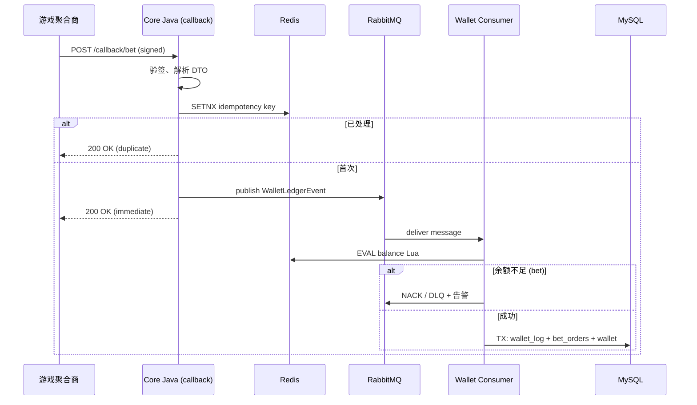

# Bet/Win 回调数据流（序列图）

## 时序



## 幂等键设计

```
idempotency:{aggregatorCode}:{providerTransactionId}
```

DB 兜底：

```sql
UNIQUE KEY uk_agg_txn (aggregator_id, provider_txn_id)
```

## 消息体（WalletLedgerEvent 示意）

```json
{
  "eventId": "uuid",
  "eventType": "BET",
  "userId": 10001,
  "aggregatorId": 1,
  "providerTxnId": "ext-123",
  "roundId": "r-456",
  "amount": 1000,
  "currency": "USD",
  "occurredAt": "2026-05-23T12:00:00Z",
  "traceId": "req-abc"
}
```

## 失败处理

| 场景 | 策略 |
|------|------|
| Redis 幂等命中 | 同步返回 200，不投递 MQ |
| MQ 投递失败 | 返回 5xx，聚合商重试（依赖厂商策略） |
| Lua 余额不足 | DLQ + 运营对账 / 通知聚合商 |
| MySQL 写失败 | 重试；Redis 已扣需 **冲正脚本** 或对账任务修复 |

## 冲正（预留）

独立事件类型 `REFUND` / `ROLLBACK`，同链路入队，Lua 反向加减，保证与 Bet 同一幂等体系。
