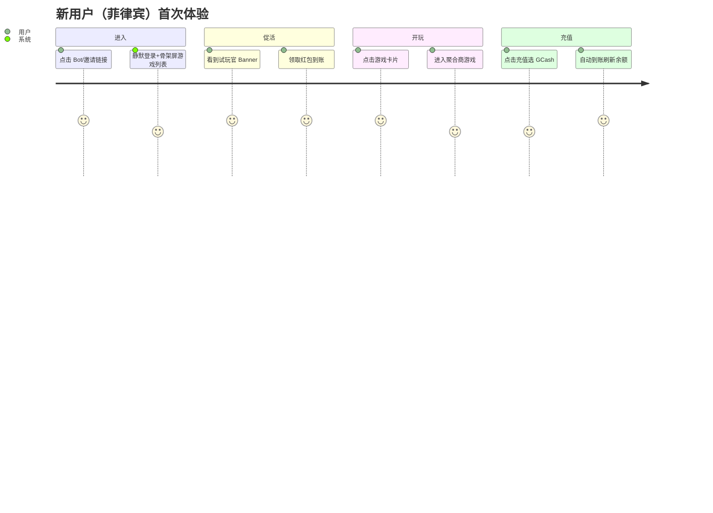

# C 端客户端产品方案（Mini App）

> **文档状态**：v1.0 · 对齐 [PRODUCT-PLAN.md](./PRODUCT-PLAN.md)  
> **平台**：Telegram Mini App（WebView）· 主攻菲律宾  
> **关联**：[美术设计指南](./ART-DESIGN-GUIDE.md) · [技术架构](../architecture/02-technical-architecture.md)

---

## 一、设计目标与原则

### 1.1 核心目标

| 目标 | 度量 |
|------|------|
| **极速开玩** | 冷启动 → 可点击游戏卡片 ≤ 2s（骨架屏先行） |
| **余额可信** | 首页上半屏常驻 PHP 主余额 + 币余额入口 |
| **转化充提** | 充值/提现最多 3 步到达支付渠道 |
| **活动可感知** | 试玩官/邀请红包有明确入口与进度 |
| **TG 原生感** | 适配 TG 主题、安全区、Haptic、BackButton |

### 1.2 体验原则

1. **首页即大厅**：不设与首页重复的「游戏 Tab」。
2. **一手可达**：充提、活动、客服在上半屏导航；游戏在下半屏。
3. **状态可见**：维护、试玩、风控、KYC、游戏锁 — 均有明确 UI 反馈。
4. **菲律宾本地化**：EN 默认 + FIL；金额 ₱ 优先；通道图标 GCash/Maya 等。
5. **负责任披露**：18+、竞彩参与提示、流水规则在提现/红包页可读。

---

## 二、用户旅程地图



| 旅程 | 关键页面 | 流失风险 | 对策 |
|------|----------|----------|------|
| 邀请进入 | 首页 + 红包弹层 | 未绑邀请关系 | 首屏 toast 提示「已通过好友邀请」 |
| 试玩官 | 活动页 | 规则不懂 | 图解步骤 + FIL 译文 |
| 首充 | 充值页 | 渠道不信任 | 展示牌照/安全文案 + 官方通道 Logo |
| 首提 | 提现 + KYC | KYC 繁琐 | 分步表单 + 进度条 |
| 多设备 | 游戏锁弹窗 | 困惑 | 明示「请先在另一设备退出游戏」 |

---

## 三、信息架构（IA）

```
Mini App
├── 首页（大厅）                    [默认落地]
├── 钱包
│   ├── 资产总览（PHP / Crypto）
│   ├── 充值 → 渠道选择 → 支付中 → 结果
│   ├── 提现 → 渠道 / KYC 门禁 → 确认 → 结果
│   └── 流水列表 → 流水详情
├── 我的
│   ├── 资料（TG 头像/昵称/ID）
│   ├── 邀请有礼
│   ├── 红包记录
│   ├── KYC 中心
│   ├── 消息中心（站内）
│   └── 设置（语言、理性竞彩、关于）
├── 活动
│   ├── 有偿试玩官
│   └── 邀请规则/进度
├── 游戏
│   ├── 启动 Loading
│   └── 游戏容器（WebView / openLink）
└── 系统
    ├── 全站维护页
    ├── 游戏锁/风控/错误弹窗
    └── 空态/骨架屏
```

**全局导航**

- 采用 **Tonplay 式底栏 4 项** + 客服 FAB（见 HOME-PAGE-DESIGN-PH）：`Home` | `Wallet` | `Promo` | `Menu`。
- 顶栏头像、Promo 红点承担「我的 / 活动」入口；**不设独立 竞彩 Tab**（首页即大厅）。

---

## 四、页面规格（逐屏）

### 4.1 启动与登录（无独立登录页）

| 状态 | UI | 逻辑 |
|------|-----|------|
| 冷启动 | 全屏品牌 Splash（≤1s）→ 首页骨架 | 并行：initData 登录 API |
| 登录失败 | 全屏错误 +「从 Telegram 重新打开」 | 非 TG 环境拦截 |
| 账号冻结 | 全屏说明 + 客服入口 | 禁止进游戏 |
| 全站维护 | 维护页（运营配置文案/图） | 阻断 |

**首登红包（可选）**：登录成功后若命中试玩官 → 半屏 **Bottom Sheet** 红包领取（不阻断列表加载）。

---

### 4.2 首页（大厅）— 核心屏

> **详细菲版方案**（Tonplay 结构参考）：[HOME-PAGE-DESIGN-PH.md](./HOME-PAGE-DESIGN-PH.md)

#### 布局（Manila Night · 上下半屏合一页滚动）

| 区域 | 高度 | 内容 | 滚动 |
|------|------|------|------|
| **顶栏** | 56px + safe-area | Logo；`₱ PHP▾` + 余额；**Deposit** 蓝钮；TG 头像 | 固定 |
| **快捷卡** | 88px | 横滑：试玩官、邀请红包、GCash、USDT | 横滑 |
| **Banner** | 152–168px | 菲节日视觉轮播（试玩/邀请/厂商活动） | 固定 |
| **搜索+Tab** | 44px | 搜索；All/Slots/Live/Hot/**Perya** | **吸顶 sticky** |
| **Play Again** | ~180px | 横滑大卡（有历史才显示） | 纵滚内 |
| **Hot 区** | ~180px | 横滑热门 + `All` | 纵滚内 |
| **All Games** | 剩余 | **2 列网格** 主列表 | 纵滚 |
| **底栏** | 56px | Home / Wallet / Promo(红点) / Menu | 固定 |
| **客服 FAB** | 48px | 右下耳机图标 | 固定 |

#### 游戏卡片

| 元素 | 说明 |
|------|------|
| 封面图 | 1:1 圆角 12px，懒加载 |
| 名称 | 最多 2 行截断 |
| 标签 | `HOT` / `NEW` / `DEMO` / `维护` |
| 点击 | 整卡可点；维护态置灰不可点 |

#### 交互

| 操作 | 反馈 |
|------|------|
| 下拉刷新 | 刷新余额 + 游戏列表 |
| 切换 Tab | 列表切换动画 200ms；缓存已加载 Tab |
| 点击游戏 | Haptic → 请求游戏锁 → Loading 页 |
| 游戏锁失败 | 弹窗：标题 + 说明 +「知道了」 |

#### 空态

- 该分类无游戏：插画 + `No games in this category`
- 网络失败：`Retry` 按钮

---

### 4.3 游戏启动与进行中

| 步骤 | UI |
|------|-----|
| 1 | 全屏 Loading（游戏名 + 进度条/indeterminate） |
| 2a | **内嵌 WebView**（推荐）：顶栏「← 返回大厅」+ 游戏区 |
| 2b | **openLink**：提示「正在打开游戏」→ 返回 TG 后 onResume 刷新余额 |

| 事件 | UI |
|------|-----|
| 退出游戏 | 释放锁；回首页；Toast「余额已更新」 |
| 超时无操作 | 弹窗是否继续；否 → 释放锁 |
| Provider 维护 | 卡片已拦截；若 API 失败 → Toast |

---

### 4.4 钱包 — 资产总览

```
┌─────────────────────────────────┐
│  Total Balance (PHP)            │
│  ₱ 12,345.67                    │
│  ≈ $ xxx.xx (可选参考)           │
├─────────────────────────────────┤
│  [Crypto] USDT    50.00         │  → 点击进入币本子页
├─────────────────────────────────┤
│  [ Deposit ]    [ Withdraw ]    │  主 CTA 并排
├─────────────────────────────────┤
│  Frozen: ₱ 100.00 (提现处理中)    │  有条件展示
├─────────────────────────────────┤
│  Transaction History  >           │
└─────────────────────────────────┘
```

---

### 4.5 充值流程

| 步骤 | 页面 | 要点 |
|------|------|------|
| 1 | 选择币种 | PHP / USDT（Tab 或分段控件） |
| 2 | 输入金额 | 快捷金额 chip：₱100/500/1000… |
| 3 | 选择渠道 | 列表：TG Wallet、GCash、Maya、USDT-TRC20… |
| 4 | 确认 | 费率、预计到账、条款勾选 |
| 5 | 支付中 | 倒计时、勿关闭提示；TG Wallet 调起 SDK |
| 6 | 结果 | 成功/失败/处理中；回首页或再充 |

**合规文案**：底部小字 18+ · 理性竞彩链接。

---

### 4.6 提现流程

| 步骤 | 页面 | 要点 |
|------|------|------|
| 0 | KYC 门禁 | 法币渠道未 KYC → 引导 KYC 中心（不可跳过） |
| 1 | 选币种+渠道 | 与充值对称 |
| 2 | 输入金额 | 显示：可用、手续费、实到账 |
| 3 | 流水规则 | 展示 **当前 N 倍**、已完成/所需流水进度条 |
| 4 | 确认 | 收款账号（已绑定或新增） |
| 5 | 提交结果 | `自动审核中` / `已提交人工审核` |
| 6 | 历史 | 提现单状态时间线 |

| 风控结果 | 用户文案（EN 示例） |
|----------|---------------------|
| 自动通过 | `Withdrawal is being processed` |
| 转人工 | `Under review, usually within 24 hours` |
| 拒绝 | `Rejected: {reason}` + 解冻说明 |

---

### 4.7 KYC 中心（基础认证）

| 步骤 | 字段 | UI |
|------|------|-----|
| 1 | 姓名、生日、国籍 | 表单 |
| 2 | 证件类型 + 正反面拍照/上传 | 相机调用 |
| 3 | 自拍 / 活体（依供应商） | 可选 P1 |
| 4 | 提交 | 状态：审核中/通过/驳回 |

驳回：展示原因 + 重新提交。

---

### 4.8 流水与竞彩记录

**流水列表**

- 筛选：全部 / 充 / 提 / 游戏 / 红包  
- 行：图标、类型、金额（+绿/-红）、时间、余额快照  
- 点击 → 详情（订单号、traceId 可复制）

**竞彩记录列表**（P0 可入口在钱包二级）

- 按时间倒序；厂商局号、游戏名、竞彩下单/派彩

---

### 4.9 活动 — 有偿试玩官

| 模块 | 内容 |
|------|------|
| 头图 | 活动主视觉（运营可配） |
| 规则 | 3 步图示：注册 → 领取 → 玩游戏 |
| 进度 | 是否已领、流水要求、可提现否 |
| CTA | `Claim` / `Play Now` / `Completed` |
| 明细 | 红包金额、到账时间 |

---

### 4.10 邀请有礼

| 模块 | 内容 |
|------|------|
| 邀请码/链接 | 大按钮 `Copy Link` + Share（TG share） |
| 双向奖励说明 | 图标：你 + 好友各得 ₱xx |
| 进度列表 | 好友昵称（脱敏）、状态：已注册/已达标/已发放 |
| 注意 | 「好友需通过你的链接在 Bot 中首次打开」 |

---

### 4.11 我的

| 项 | 说明 |
|----|------|
| 头部 | TG 头像、昵称、User ID（复制） |
| 菜单 | 邀请、红包记录、KYC、消息、语言、客服、理性竞彩、关于 |
| 版本 | App 版本号 |

---

### 4.12 消息中心

- 列表：系统/充提/红包/风控  
- 未读红点；点击展开详情  
- 与 Bot Push 内容一致（可配置）

---

### 4.13 全局组件与反馈

| 组件 | 场景 |
|------|------|
| Bottom Sheet | 红包领取、渠道选择、活动规则 |
| Dialog | 游戏锁、风控拒绝、确认退出游戏 |
| Toast | 复制成功、余额刷新、轻错误 |
| Skeleton | 首页游戏 grid、流水列表 |
| Top Notice | 维护公告条（可关闭） |
| Loading Overlay | 支付中、提交提现 |

---

## 五、状态与异常（必做）

| 场景 | 类型 | 文案方向（EN） |
|------|------|----------------|
| 游戏锁占用 | Dialog | `You're playing on another device` |
| 余额不足（启动前可选） | Toast | `Insufficient balance` |
| 支付超时 | 页 | `Payment timeout. Check history or retry` |
| 提现流水不足 | 页内条 | `Turnover required: ₱X more to withdraw` |
| 网络断开 | Banner | `No connection` |
| 版本过低 | 全屏 | `Please update Telegram` |

---

## 六、Telegram Mini App 适配清单

| 项 | 要求 |
|----|------|
| `Telegram.WebApp.ready()` / `expand()` | 启动时调用 |
| `themeParams` | 见美术指南；暗色为主时可 `setHeaderColor` |
| `BackButton` | 二级页显示；首页隐藏 |
| `MainButton` | 充值确认、KYC 提交等关键 CTA |
| `HapticFeedback` | 领取红包、游戏启动 |
| Safe Area | `env(safe-area-inset-*)` 顶底留白 |
| 视口 | `viewport-fit=cover`；禁止页面级横向滚动 |
| 关闭确认 | 游戏中返回 → 确认释放锁 |

---

## 七、文案与语言

| 项 | 规则 |
|----|------|
| 默认语言 | English |
| 第二语言 | Filipino (FIL) — 关键页完整翻译 |
| 金额 | `₱ 1,234.56`；币 `50.00 USDT` |
| 日期 | `MMM D, YYYY` 或 PH 习惯 `DD/MM/YYYY`（统一一种） |
| 语气 | 简短、行动导向：`Deposit Now`, `Play Now` |

**i18n 键命名**：`home.balance.label`, `withdraw.turnover.hint`

---

## 八、与开发对齐的组件清单（Vue）

| 组件 | 用途 |
|------|------|
| `AppShell` | 安全区 + TG 主题 |
| `HomeHeader` | Logo/充提/余额/导航/Banner |
| `CategoryTabs` | sticky Tab |
| `GameGrid` / `GameCard` | 游戏列表 |
| `BalanceDisplay` | 多币种 |
| `PaymentChannelPicker` | 充提渠道 |
| `TurnoverProgress` | 流水进度条 |
| `RedPacketSheet` | 红包 |
| `GameLockDialog` | 多设备 |
| `MaintenanceBanner` | 公告 |
| `KycStepForm` | 分步 KYC |

Tailwind 设计令牌见 [ART-DESIGN-GUIDE.md](./ART-DESIGN-GUIDE.md)。

---

## 九、MVP 页面优先级

| 优先级 | 页面 |
|--------|------|
| P0 | 首页、游戏 Loading/WebView、钱包、充提、流水、试玩官、邀请、游戏锁/维护 |
| P1 | KYC 完整流、消息中心、竞彩记录详情、FIL 全覆盖 |
| P2 | 搜索游戏、最近玩过、动效增强 |

---

## 十、验收标准（UX）

- [ ] 冷启动 2s 内可见游戏骨架并可滚动  
- [ ] 首页上半屏余额与充提按钮始终可见（游戏列表滚动时 Tab 吸顶）  
- [ ] 充值从首页 ≤3 次点击进入支付  
- [ ] 法币提现未 KYC 无法跳过  
- [ ] 流水倍数 N 在提现页可见且与后台一致  
- [ ] 游戏锁在第二设备有明确 Dialog  
- [ ] 支持 EN；FIL 核心路径无英文混杂（P1 全量）  

---

## 修订记录

| 版本 | 日期 | 说明 |
|------|------|------|
| v1.0 | 2026-05-23 | 初版，对齐 PRD v1.0 |
