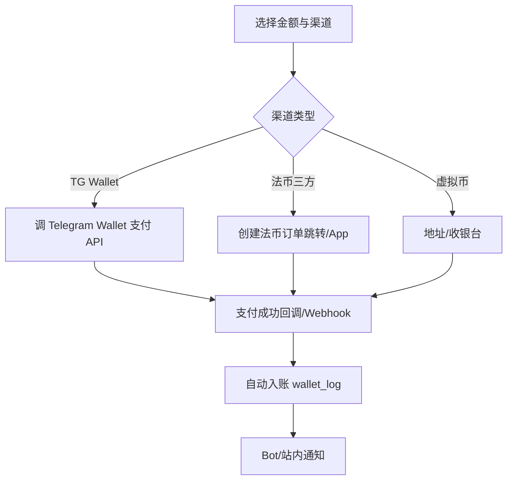
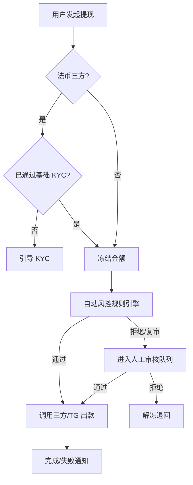

# Telegram Mini App 博彩聚合平台 — 产品方案

> **文档状态**：PRD v1.0（已按 2026-05-23 评审结论更新）  
> **目标市场**：菲律宾（Philippines）优先  
> **对齐技术栈**：Vue3 TMA + Node BFF + Java Core + MySQL/Redis/RabbitMQ  
> **关联文档**：[业务架构](../architecture/01-business-architecture.md) · [技术架构](../architecture/02-technical-architecture.md) · [C 端产品方案](./CLIENT-PRODUCT-DESIGN.md) · [美术/UI 指南](./ART-DESIGN-GUIDE.md)

---

## 〇、已确认决策摘要

| # | 决策 |
|---|------|
| 1 | **仅对接 1 家** 游戏聚合商（其下含多个游戏厂商/Game Provider） |
| 2 | 支付：**Telegram Wallet**（非 Stars）+ 第三方支付（法币 PHP + 虚拟币）；**全自动到账，无人工审核充值** |
| 3 | **首页即大厅**：上半屏 Logo / 余额 / 导航 / Banner；下半屏游戏列表 + 分类 Tab，最短路径进游戏 |
| 4 | 增长：**有偿试玩官红包**（新用户）+ **老带新双向红包**；**不做佣金/流水返佣**（前期） |
| 5 | 提现：TG 相关 + 三方（法币 App + 虚拟币）；**自动风控 → 不通过转人工**；三方法币提现需 **基础 KYC** |
| 6 | 币种：**PHP（比索）+ 虚拟币** 上线；架构预留 VND、IDR 等 |
| 7 | 提现流水倍数 **N** 在运营后台 **可配置**（可按用户标签/全局/活动覆盖，见 8.5） |
| 8 | 同 TG 账号 **可多设备登录** Mini App；**禁止多设备同时处于游戏中**（单活跃游戏会话） |
| 9 | **独立 Web 运营后台**（非 Admin Mini App） |
| 10 | **试玩/真钱** 在运营后台按 **游戏厂商（Provider）** 维度配置（单聚合商下多 Provider） |
| 11 | **系统通知、维护公告** 统一在运营后台配置与下发 |

---

## 一、产品概述

### 1.1 一句话定位

面向 **菲律宾市场** 的 Telegram Mini App：**打开即玩** 的单一聚合游戏入口，**PHP + 加密资产** 统一钱包，自动充提与红包拉新，无佣金分销。

### 1.2 要解决的核心问题

| 用户痛点 | 平台解法 |
|----------|----------|
| 找游戏路径长 | 首页下半屏直接展示可玩游戏 + 分类 Tab |
| 充值慢、要人工 | TG Wallet + 三方支付全自动回调入账 |
| 拉新成本高 | 试玩官红包 + 邀请双向红包（非佣金） |
| 资金与安全 | 自动风控 + 人工复核兜底；法币提现 KYC |

### 1.3 产品边界

| 我们做 | 我们不做（前期） |
|--------|------------------|
| 对接 **1 家** 聚合商及其下多 Provider | 对接多家聚合商竞态路由 |
| TG 登录、统一钱包、首页直达游戏 | 自研游戏 / 坐庄 |
| TG Wallet + 三方充提（法币+币） | Telegram **Stars** 支付（规避封禁与博彩政策风险） |
| 红包活动、邀请绑定与发放 | **流水佣金 / 多级代理分润** |
| 独立运营后台（配置、通知、维护、风控） | 重型 BI、人工充值审核台 |

### 1.4 商业模式（前期）

| 模式 | 说明 | 阶段 |
|------|------|------|
| **聚合商分成** | GGR/NGR 合同分成，系统记账 | MVP |
| **充提手续费** | 可配置 | MVP |
| **红包营销** | 试玩官、邀请双向红包（平台补贴） | MVP |
| **流水佣金** | 代理分润 | **不做** |

---

## 二、目标用户与场景

### 2.1 用户角色

| 角色 | 描述 | MVP |
|------|------|-----|
| **终端玩家（PH）** | TG 用户，英语/他加禄语界面优先 | ✅ |
| **受邀新用户** | 通过试玩活动或邀请链接进入 | ✅ |
| **邀请人（老用户）** | 分享链接，好友达标后双方得红包 | ✅ |
| **运营** | 独立后台配置游戏、活动、通知、维护 | ✅ |
| **风控/客服** | 处理自动风控转人工的提现单 | ✅ |

### 2.2 典型用户故事

**玩家**

1. 打开 Mini App 后 **3 秒内** 看到余额和可玩游戏，无需多 Tab 寻找。
2. 使用 **GCash 等法币通道或 USDT 等** 充值，到账后自动增加 PHP/币余额。
3. 进入游戏后，另一台设备打开游戏应被提示「账号正在其他设备游戏中」。
4. 提现时，走法币三方需完成 **基础 KYC**；虚拟币/TG 相关通道按规则免或简 KYC。

**增长**

5. 新用户注册后领取 **试玩官红包**（含流水要求则见活动规则）。
6. 老用户分享邀请链接，好友 **首次注册并满足活动条件** 后，**双方** 各得红包。

**运营**

7. 按 **游戏 Provider** 开关试玩/真钱、维护态。
8. 配置全局提现流水倍数 N、Banner、全站维护、推送模板。
9. 查看自动风控失败的提现队列并人工处置。

---

## 三、产品架构（业务模块）

```
┌──────────────────────────────────────────────────────────────┐
│  Telegram：Bot · Mini App · start_param 邀请 · Wallet 支付    │
│  （明确不使用 Stars 作为博彩支付手段）                          │
└────────────────────────────┬─────────────────────────────────┘
                             │
     ┌───────────────────────┼───────────────────────┐
     ▼                       ▼                       ▼
┌─────────────┐      ┌──────────────┐       ┌──────────────┐
│ 首页游戏大厅  │      │ 钱包 & 支付   │       │ 我的 & 活动   │
│ 极速触达游戏  │      │ PHP/币 余额   │       │ 邀请/红包/KYC │
└─────────────┘      └──────────────┘       └──────────────┘
                             │
                    ┌────────▼────────┐
                    │ 平台核心         │
                    │ 钱包 · 账变 · MQ │
                    │ 单聚合商适配层    │
                    └────────┬────────┘
         ┌───────────────────┼───────────────────┐
         ▼                   ▼                   ▼
  ┌─────────────┐    ┌─────────────┐    ┌─────────────────┐
  │ 支付中心     │    │ 风控中心     │    │ 运营后台 (Web)   │
  │ TG Wallet   │    │ 自动+人工    │    │ 游戏/活动/通知   │
  │ 三方法币/币  │    │ 流水倍数 N   │    │ 维护/KYC/试玩配置 │
  └─────────────┘    └─────────────┘    └─────────────────┘
```

---

## 四、C 端信息架构与首页布局（核心体验）

### 4.1 设计原则：**首页即大厅，最短路径进游戏**

取消「首页 vs 游戏 Tab 重复」的结构；主界面单页承载运营位与游戏列表，钱包/我的以 **顶部导航图标或底部轻量入口** 进入。

### 4.2 首页线框（上下半屏）

```
┌─────────────────────────────────────┐ 上半屏 (~40–45vh)
│ [Logo]              [充值] [提现]    │  品牌 + 快捷支付
│ 余额：₱ 1,234.56  |  USDT 50.00     │  多币种展示（主显 PHP）
│ [活动] [邀请] [客服] [语言]          │  轻量导航（可配置）
│ ┌─────────────────────────────────┐ │
│ │         Banner 轮播              │ │  运营配置
│ └─────────────────────────────────┘ │
├─────────────────────────────────────┤ 下半屏 (~55–60vh)
│ [全部][电子][真人][体育][热门] ...   │  分类 Tab（横向滚动）
│ ┌────┐ ┌────┐ ┌────┐ ┌────┐      │
│ │游戏│ │游戏│ │游戏│ │游戏│      │  可直接点击启动
│ └────┘ └────┘ └────┘ └────┘      │
│         （列表/网格滚动）            │
└─────────────────────────────────────┘
```

**交互要求**

- 冷启动：静默登录 → **直接渲染下半屏游戏**（骨架屏），余额与 Banner 异步刷新。
- 游戏卡片展示：维护中/试玩标签（由 Provider 配置驱动）。
- 点击游戏 → 校验 **单设备游戏锁** → 启动聚合商 URL。

### 4.3 次级页面（非 Tab 主结构）

| 入口 | 页面 | MVP |
|------|------|-----|
| 余额/钱包图标 | 钱包：充提、流水、币种切换 | ✅ |
| 我的 | 资料、邀请分享、红包记录、KYC 状态 | ✅ |
| 活动 | 试玩官/邀请规则页 | ✅ |
| 游戏启动页 | Loading + 内嵌/WebView | ✅ |

### 4.4 页面清单

| 页面 | 功能 | 阶段 |
|------|------|------|
| 首页（大厅） | 上下半屏布局、分类 Tab、直达启动 | P0 |
| 充值 | 渠道：TG Wallet / 法币三方 / 虚拟币 | P0 |
| 提现 | 渠道选择、KYC 引导、风控结果展示 | P0 |
| 流水/注单 | 账变列表、注单详情 | P0 |
| 邀请有礼 | 链接复制、双方红包进度 | P0 |
| 试玩官活动 | 规则、领取、流水要求 | P0 |
| KYC 基础认证 | 法币提现前置（证件+姓名等） | P0 |
| 维护/公告 | 全站维护时拦截或顶部条 | P0 |

---

## 五、核心业务流程

### 5.1 登录、多设备与老带新（TMA 能力说明）

#### 5.1.1 登录逻辑

1. 用户从 Bot 菜单、Mini App 按钮或 **邀请 deep link** 打开 WebApp。
2. 前端提交 `Telegram.WebApp.initData` → BFF 校验 HMAC（Bot Token）。
3. 以 **`telegram_user_id` 为唯一账号键** 查/建用户，签发 Session（Redis），**与设备无关**。

因此：**同一 TG 账号可在手机、平板、桌面 Telegram 同时登录 Mini App**（多 Session 并存或共享策略见技术方案，产品侧允许多端在线）。

#### 5.1.2 老带新是否支持？— **支持**

| 能力 | TMA/TG 机制 | 产品用法 |
|------|-------------|----------|
| 邀请传参 | Bot deep link：`t.me/<bot>?start=inv_<code>` → `start_param` | 运营/用户分享此链接 |
| 首次绑定 | 用户 **首次** 完成注册时 BFF 解析 `start_param`，写入 `inviter_id` | 仅一次，防刷改绑走后台 |
| 直接打开 WebApp | 无 `start_param` 时无法自动知邀请人 | 必须引导「从邀请链接进入 Bot 再打开 App」或活动页补填码（可选 P1） |
| 红包发放 | 业务层：好友满足「注册+活动条件」→ 触发双向 `RED_PACKET` 账变 | 与佣金无关 |

**产品约束（防刷）**

- 邀请绑定仅 **首次注册** 生效；同设备多号、自邀自用由风控规则拦截（设备指纹/TG id 关联，技术实现放风控模块）。
- 红包：**不可提现或需流水倍数** 由活动在运营后台配置（见 5.6）。

#### 5.1.3 单设备游戏锁（与多设备登录并存）

```
用户 A 在设备1 启动游戏 G → 写入 Redis game_session:{userId} = {deviceId, gameId, ttl}
用户 A 在设备2 再启动任意游戏 → 拒绝或提示「已在设备1游戏中」
用户 A 在设备1 退出/会话超时 → 释放锁
```

- **登录**：多端允许。  
- **游戏**：全局仅 **一个活跃游戏会话**（可按聚合商要求调整为 per-provider，默认全局）。

### 5.2 进入游戏

1. 校验用户状态、Provider 维护态、试玩/真钱模式。
2. 获取 **游戏锁**。
3. 调聚合商 launch API（带 userId、币种、试玩标志）。
4. 退出/超时释放锁；回到首页刷新余额。

### 5.3 下注与派彩

与既有技术方案一致：聚合商回调 → Redis 幂等 → MQ → 异步账变。  
币种维度：**PHP 与虚拟币分账本或分 wallet 科目**（见 8.1）。

### 5.4 充值（全自动）



**合规与通道策略**

| 通道 | 用途 | 注意 |
|------|------|------|
| **Telegram Wallet** | TG 生态内便捷支付 | 使用官方 **Wallet** 能力；**不使用 Stars** 承载博彩充值，降低 Bot/Mini App 被封风险 |
| **第三方法币** | PHP：GCash、Maya、银行转账等（依接入商） | 需持牌支付合作与 PH 合规评估 |
| **第三方虚拟币** | USDT 等 | 链上确认数可配置；与 PHP 钱包科目分离展示 |

- **无人工审核充值**；异常单（回调重复、金额不符）走 **对账任务 + 运营调账**，非常规路径。

### 5.5 提现（自动风控 + 人工兜底）



**通道**

| 类型 | 示例 | KYC |
|------|------|-----|
| TG 相关 | Telegram Wallet 提现能力（以官方支持为准） | 按通道要求 |
| 法币 App | GCash、Maya 等 | **必须基础 KYC** |
| 虚拟币 | 链上地址 | 地址绑定 + 风控规则，可简 KYC |

**自动风控规则（MVP 示例，均可后台配置开关与阈值）**

- 可用余额 ≥ 提现额 + 手续费  
- **有效流水 ≥ 充值额 × N**（**N 后台可配**，见 8.5）  
- 红包金额计入流水规则：**可配置**（建议红包仅作 bonus 需单独流水倍数）  
- 单日/单笔限额、注册时长、首提延迟  
- 黑名单 TG/设备/IP  
- 不通过 → **自动转人工**，运营后台处理

### 5.6 增长活动：有偿试玩官 + 老带新红包

#### 活动 A：有偿试玩官（新用户）

| 项 | 说明 |
|----|------|
| 目标 | 拉新、降低首玩门槛 |
| 触发 | 新注册 + 活动有效期内 + 风控通过 |
| 奖励 | 红包入账（`wallet_log`: `RED_PACKET_TRIAL`） |
| 约束 | 是否需绑定手机/最低充值/流水方可提现 — **运营后台配置** |

#### 活动 B：老带新双向红包

| 项 | 说明 |
|----|------|
| 目标 | 裂变 |
| 触发 | 被邀请人 **首次注册**（`start_param`）且满足条件（如完成首充或有效注册 24h） |
| 奖励 | 邀请人、被邀请人各一笔红包（`RED_PACKET_REFERRAL_INVITER` / `INVITEE`） |
| 不做 | 佣金、持续流水分成 |

**运营配置项**：金额、有效期、每人上限、总预算熔断、流水/提现限制。

### 5.7 试玩模式（按游戏 Provider 配置）

单聚合商对接多个 **Game Provider**（厂商）：

| 配置项 | 说明 |
|--------|------|
| `provider.demo_enabled` | 该厂商下游戏是否允许试玩 |
| `provider.real_money_enabled` | 是否允许真钱 |
| 启动参数 | launch API 传 `demo=true/false`（依聚合商文档） |

运营后台：**Provider 维度** 批量/单个开关；游戏级可覆盖（可选 P1）。

### 5.8 通知与维护（运营后台）

| 能力 | 说明 |
|------|------|
| **系统通知** | 充值到账、提现结果、红包到账、风控补件；Bot Push + Mini App 站内信 |
| **维护模式** | 全站 / 单 Provider / 单游戏；维护时首页展示公告，禁止启动 |
| **Banner/公告** | 与首页上半屏 Banner 联动 |
| **模板管理** | 多语言（EN / FIL 优先） |

---

## 六、功能需求明细

### 6.1 账户与登录

| ID | 需求 | 验收标准 | 阶段 |
|----|------|----------|------|
| ACC-01 | TG initData 静默登录 | 3s 内进入首页并看到游戏列表骨架 | P0 |
| ACC-02 | 用户建档 | `telegram_user_id` 唯一 | P0 |
| ACC-03 | 多设备 Session | 多设备可同时持有有效 Session | P0 |
| ACC-04 | 邀请 `start_param` | 首次注册绑定 `inviter_id` | P0 |
| ACC-05 | 单活跃游戏会话 | 第二设备启动游戏被拒绝并提示 | P0 |
| ACC-06 | 账号 freeze/ban | 冻结后不可游戏、不可提 | P0 |
| ACC-07 | 语言 | EN / FIL（菲律宾语）优先 | P0 |

### 6.2 首页与游戏

| ID | 需求 | 验收标准 | 阶段 |
|----|------|----------|------|
| HM-01 | 上半屏 | Logo、余额（PHP 主显+币）、导航、Banner | P0 |
| HM-02 | 下半屏 | 分类 Tab + 可玩游戏列表，点击即启动 | P0 |
| GM-01 | 单聚合商 | 仅一家聚合配置生效 | P0 |
| GM-02 | Provider 维护/试玩标签 | 卡片展示状态 | P0 |
| GM-03 | 启动游戏 | 含游戏锁校验 | P0 |

### 6.3 钱包与币种

| ID | 需求 | 验收标准 | 阶段 |
|----|------|----------|------|
| WL-01 | PHP 余额 | 整数分存储，展示 2 位小数 | P0 |
| WL-02 | 虚拟币余额 | 独立科目或子钱包 | P0 |
| WL-03 | 流水类型 | DEPOSIT/WITHDRAW/BET/WIN/RED_PACKET_*/ADJUST | P0 |
| WL-04 | 币种预留 | 配置层支持 VND/IDR 未启用 | P1 |

### 6.4 支付

| ID | 需求 | 验收标准 | 阶段 |
|----|------|----------|------|
| PY-01 | TG Wallet 充值 | 回调自动入账，无人工 | P0 |
| PY-02 | 三方法币充值 PHP | Webhook 自动入账 | P0 |
| PY-03 | 三方虚拟币充值 | 确认数可配，自动入账 | P0 |
| PY-04 | 提现通道 | TG + 法币 App + 链 | P0 |
| PY-05 | 法币提现 KYC 门禁 | 未 KYC 不可提交法币提现 | P0 |
| PY-06 | 禁用 Stars | 产品与技术均不接入 Stars 博彩支付 | P0 |

### 6.5 风控与 KYC

| ID | 需求 | 验收标准 | 阶段 |
|----|------|----------|------|
| RK-01 | 自动风控引擎 | 可配置规则链，输出 pass/fail/manual | P0 |
| RK-02 | 人工审核队列 | fail/manual 单可审批、备注 | P0 |
| RK-03 | 流水倍数 N | 后台可调，实时生效（新单） | P0 |
| RK-04 | 基础 KYC | 姓名、证件、自拍等（依合规最小集） | P0 |

### 6.6 增长活动

| ID | 需求 | 验收标准 | 阶段 |
|----|------|----------|------|
| PR-01 | 试玩官红包 | 新用户达标自动发放 | P0 |
| PR-02 | 邀请双向红包 | 绑定+达标后双方到账 | P0 |
| PR-03 | 无佣金 | 系统无 commission 结算模块 | P0 |

### 6.7 运营后台（独立 Web）

| ID | 需求 | 验收标准 | 阶段 |
|----|------|----------|------|
| OP-01 | RBAC 登录 | 角色：运营/风控/超管 | P0 |
| OP-02 | 游戏/Provider | 上下架、排序、试玩/真钱、维护 | P0 |
| OP-03 | Banner/首页 | 配置上半屏 Banner 与导航 | P0 |
| OP-04 | 活动/红包 | 试玩官、邀请红包规则与预算 | P0 |
| OP-05 | 支付通道 | 开关、费率、限额 | P0 |
| OP-06 | 风控规则 | 流水倍数 N、限额、黑白名单 | P0 |
| OP-07 | 提现人工队列 | 审核、打款、拒绝解冻 | P0 |
| OP-08 | KYC 审核 | 查看用户提交、通过/驳回 | P0 |
| OP-09 | 通知模板 | Bot/站内信模板 CRUD | P0 |
| OP-10 | 维护公告 | 全站/Provider/游戏级维护 | P0 |
| OP-11 | 调账 | ADJUST 流水，权限与审计日志 | P1 |

### 6.8 Bot

| ID | 需求 | 验收标准 | 阶段 |
|----|------|----------|------|
| BOT-01 | /start + WebApp 按钮 | 打开即首页大厅 | P0 |
| BOT-02 | 邀请 deep link | `start=inv_<code>` | P0 |
| BOT-03 | 业务通知 | 充提、红包、提现审核结果 | P0 |

---

## 七、MVP 范围与路线图

### 7.1 Go-Live 必须交付

- 菲律宾市场：EN/FIL、**PHP + 主流虚拟币** 钱包  
- **单聚合商** 对接，多 Provider 游戏列表与 launch  
- **首页上下半屏** 直达游戏  
- TG Wallet + 三方 **自动充提**（无人工充值审核）  
- Bet/Win 账变闭环  
- 试玩官 + 邀请双向红包  
- 提现 **自动风控 + 人工队列**；法币提现 **KYC**  
- 流水倍数 **后台可配**  
- **多设备登录 + 单设备游戏锁**  
- **独立运营后台**：游戏、活动、支付、风控、通知、维护  

### 7.2 明确不做（前期）

- 流水佣金 / 代理分润体系  
- 多家聚合商切换  
- Telegram **Stars** 支付  
- 人工充值审核台（改为异常对账）  

### 7.3 版本建议

| 版本 | 内容 |
|------|------|
| v0.1 | 单聚合商回调 + 首页大厅 + 假支付联调 |
| v0.2 | 真实支付 + 红包活动 + 游戏锁 |
| v0.3 | 风控/KYC/运营后台全量 + PH 小流量公测 |

---

## 八、数据与业务规则

### 8.1 币种模型

| 币种类型 | MVP | 存储 | 预留 |
|----------|-----|------|------|
| **PHP** | ✅ 主法币 | 最小单位：sentimo（分） | — |
| **虚拟币** | ✅ USDT 等 | 最小单位：链标准 | — |
| VND / IDR 等 | 配置占位 | 不展示 | 表结构 `currency_code` 枚举可扩展 |

- 用户可同时持有 **PHP 余额** 与 **币余额**；游戏 launch 时指定结算币种（依聚合商与游戏支持）。

### 8.2 钱包与流水类型

`DEPOSIT` | `WITHDRAW` | `BET` | `WIN` | `REFUND` | `RED_PACKET_TRIAL` | `RED_PACKET_REFERRAL_*` | `ADJUST` | `FEE`

### 8.3 提现订单状态

`CREATED` → `FROZEN` → `RISK_AUTO_RUNNING` →  
`AUTO_PASSED` → `PAYING` → `PAID` | `FAILED`  
`AUTO_FAILED` → `PENDING_MANUAL` → `MANUAL_APPROVED` / `MANUAL_REJECTED`

### 8.4 流水倍数 N（可配置）

运营后台支持：

- **全局默认 N**（如 1.0 / 1.5 / 3.0）  
- **按活动/用户标签覆盖**（如试玩官红包用户 N=5）  
- **是否将红包计入有效流水**：单独开关  

计算公式（产品定义）：

```
有效流水 = sum(符合条件的 BET 金额) - 取消/无效注单
是否可提 = 有效流水 >= (充值总额 + 红包计入部分) × N
```

### 8.5 设备与 Session

| 场景 | 行为 |
|------|------|
| 多设备打开 App | 允许，均可浏览/充提（除非风控限制） |
| 多设备同时 launch 游戏 | **禁止**；先释放锁设备方可玩 |
| Session 过期 | 重新 initData 登录 |

---

## 九、合规与风控（菲律宾 + TG）

| 领域 | 策略 |
|------|------|
| **目标市场** | 菲律宾；需本地博彩/支付法务评估 |
| **TG 支付** | 优先 **Telegram Wallet**；**禁止 Stars 用于博彩充值** |
| **KYC** | 法币三方提现：基础 KYC 必做；资料最小必要留存 |
| **负责任博彩** | 单日充值上限、自我排除（后台配置，P1 可加强） |
| **年龄** | 用户协议声明 18+；后续可加年龄确认 |
| **AML** | 大额提现人工复核；流水与充提留存 |

---

## 十、成功指标（PH MVP）

| 指标 | 目标（示意） |
|------|----------------|
| 打开 → 看到游戏列表 | > 95%，P95 < 2s |
| 首充转化率（7 日） | 按运营目标填 |
| 游戏启动成功率 | > 98% |
| 充值自动入账延迟 | P95 < 60s（法币依通道） |
| 自动风控通过率 | 监控 + 人工队列 < 某阈值 |
| 账变一致率 | > 99.99% |

---

## 十一、已关闭的待决策项（原 v0.1 清单）

原「待决策」均已按本章「〇、已确认决策摘要」关闭。后续变更走 PRD 变更记录。

---

## 十二、附录

### A. 名词表

| 术语 | 说明 |
|------|------|
| 聚合商 | MVP 仅 1 家，对接多个 Game Provider |
| Game Provider | 聚合商旗下的游戏厂商，试玩开关粒度 |
| TG Wallet | Telegram 官方钱包支付能力（非 Stars） |
| 有效流水 | 用于提现风控的累计 Bet 口径 |
| N | 提现流水倍数，运营后台可配 |

### B. 文档修订记录

| 版本 | 日期 | 说明 |
|------|------|------|
| v0.1 | 2026-05-23 | 初稿 |
| v1.0 | 2026-05-23 | 菲律宾市场、单聚合商、支付/首页/红包/风控/KYC/运营后台等 11 项决策落地 |

---

**下一步（研发）**：同步更新 [业务架构](../architecture/01-business-architecture.md) 中的分期与支付/增长描述；输出接口清单与运营后台信息架构。
